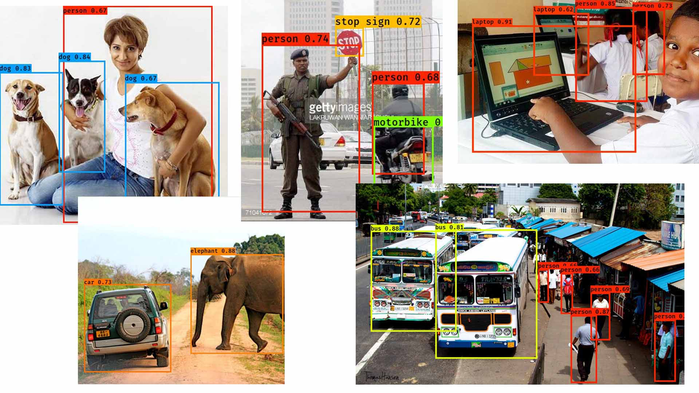
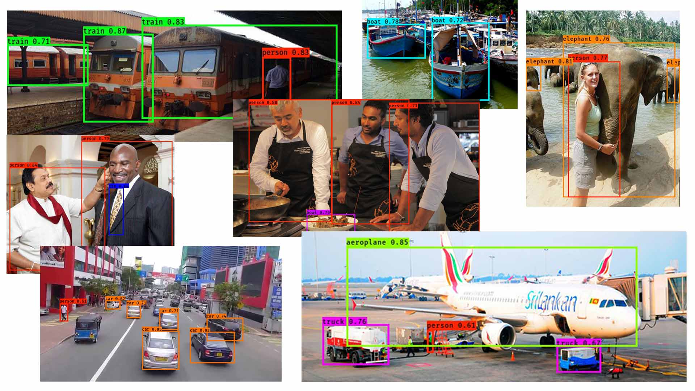

# YOLOv2 Object Detection in Keras 
This repository presents a implementation of YOLOv2 object detection using Keras library with Tensorflow backend.
Credits goes to [YAD2K Library](https://github.com/allanzelener/YAD2K) on top of which this implementation was built. 

